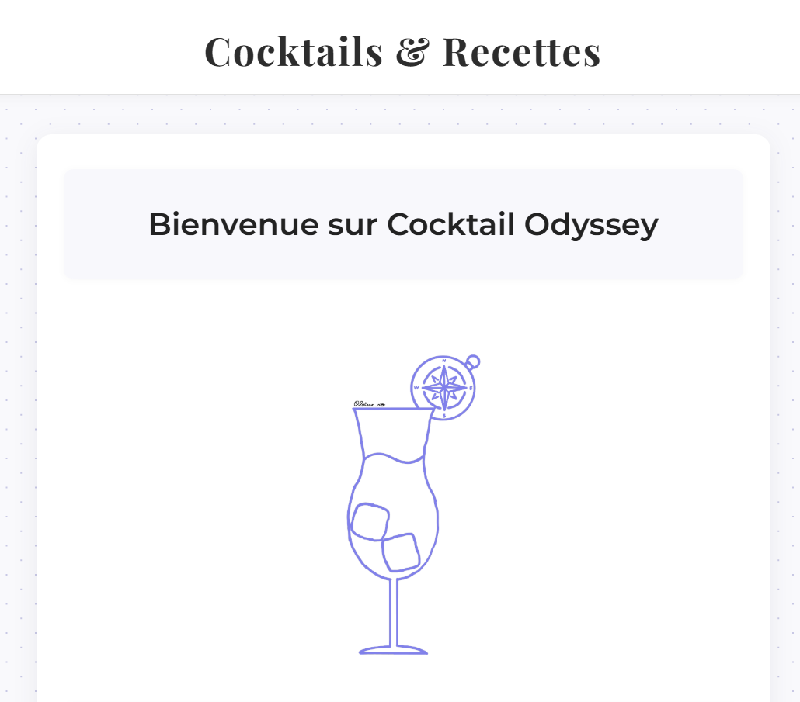
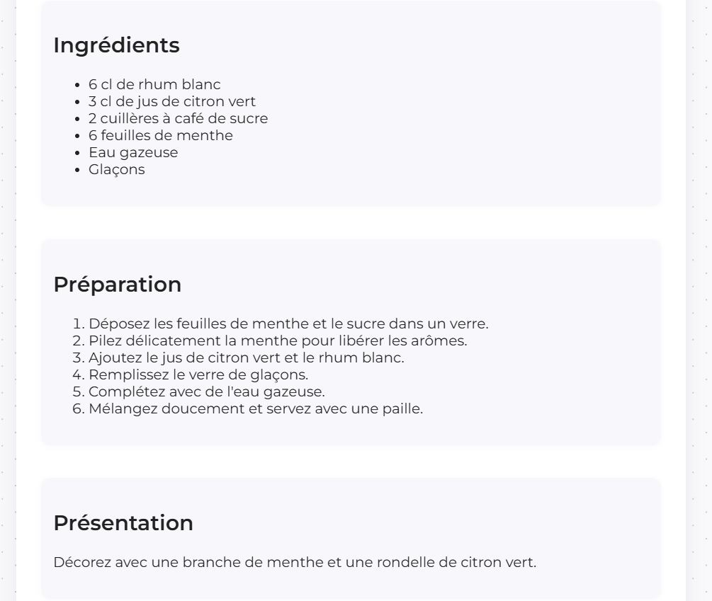

## 🦊 Bienvenue sur Cocktails Odyssey

  

## 🍸 Le Projet
**Cocktails Odyssey** est votre carnet de voyage dédié à l'art du mélange. Que vous soyez amateur de Gin, Whisky, Vodka ou Rhum, explorez une sélection de recettes créatives pour épater vos invités ou simplement vous faire plaisir. 

## 🛠️ Fonctionnalités
* **🧭 Navigation** : Trouvez facilement votre bonheur parmi les catégories Whisky, Gin, Vodka et Rhum
* **🎲 Cocktail Aléatoire** : Laissez le hasard choisir pour vous si vous hésitez
* **🏆 Top 10** : Découvrez les cocktails les plus appréciés par les français
* **📱 Responsive** : Un design épuré, pensé pour être consulté partout

## 📸 Aperçu de l'Interface

<table width="100%">
  <tr>
    <td width="50%" align="center">
      <b>🏠 Page d'accueil</b> 
      
    </td>
    <td width="50%" align="center">
      <b>🥃 Détail d'une recette</b> 
      
    </td>
  </tr>
</table>

## &nbsp;&nbsp; 🧭 L'Odyssée commence ici

  

## 💻 Stack Technique

  
  
  
  

## 🌸 Keep Pushing
> ⚠️ *L'abus d'alcool est dangereux pour la santé, à consommer avec modération.*
> 
> Si ce projet vous a plu, n'hésitez pas à laisser une ⭐ sur le repo ! 
> | ©EdgarPullès
